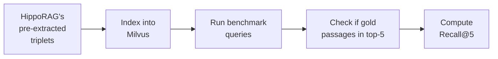
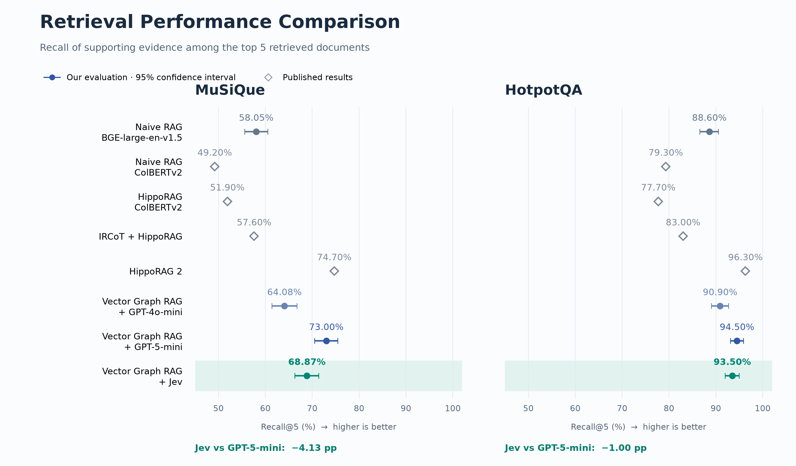
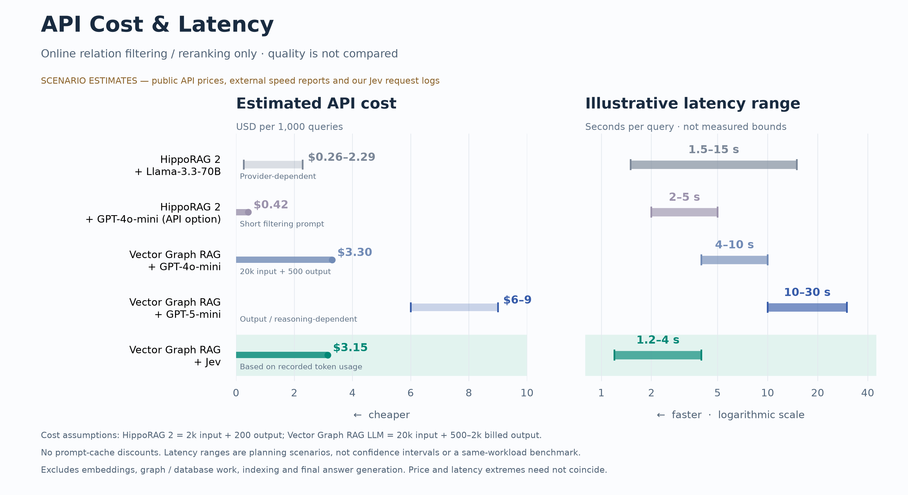

# Evaluation

Vector Graph RAG is evaluated on three standard multi-hop QA benchmarks used in the HippoRAG papers.

## Datasets

| Dataset | Description | Hop Count | Source |
|---------|-------------|-----------|--------|
| **MuSiQue** | Multi-hop questions requiring 2–4 reasoning steps | 2–4 hops | [Paper](https://arxiv.org/abs/2108.00573) |
| **HotpotQA** | Wikipedia-based multi-hop QA | 2 hops | [Paper](https://arxiv.org/abs/1809.09600) |
| **2WikiMultiHopQA** | Cross-document reasoning over Wikipedia | 2 hops | [Paper](https://arxiv.org/abs/2011.01060) |

!!! info "Evaluation Metric"
    **Recall@5** — whether the ground-truth supporting passages appear within the top-5 retrieved results. This measures retrieval quality independent of the answer generation step.

---

## Historical Results

These previously published tables are retained as historical results, before the relation-to-passage ordering correction. The new Jev replay uses corrected ordering and a separately documented sample/retrieval basis; its scores do not overwrite these tables.

### Recall@5 vs. Naive RAG


| Method | MuSiQue | HotpotQA | 2WikiMultiHopQA | Average |
|--------|---------|----------|-----------------|---------|
| Naive RAG | 55.6% | 90.8% | 73.7% | 73.4% |
| **Vector Graph RAG** | **73.0%** | **96.3%** | **94.1%** | **87.8%** |
| Improvement | +31.4% | +6.1% | +27.7% | +19.6% |

!!! success "Key Takeaway"
    Vector Graph RAG improves over Naive RAG by **+19.6% on average**, with the largest gains on datasets requiring cross-document reasoning (MuSiQue +31.4%, 2WikiMultiHopQA +27.7%).

### Comparison with State-of-the-Art


| Method | MuSiQue | HotpotQA | 2WikiMultiHopQA | Average |
|--------|---------|----------|-----------------|---------|
| HippoRAG (ColBERTv2)[^1] | 51.9% | 77.7% | 89.1% | 72.9% |
| IRCoT + HippoRAG[^1] | 57.6% | 83.0% | 93.9% | 78.2% |
| NV-Embed-v2[^2] | 69.7% | 94.5% | 76.5% | 80.2% |
| HippoRAG 2[^2] | **74.7%** | **96.3%** | 90.4% | 87.1% |
| **Vector Graph RAG** | 73.0% | **96.3%** | **94.1%** | **87.8%** |

[^1]: [HippoRAG: Neurobiologically Inspired Long-Term Memory for LLMs (NeurIPS 2024)](https://arxiv.org/abs/2405.14831)
[^2]: [From RAG to Memory: Non-Parametric Continual Learning for LLMs (2025)](https://arxiv.org/abs/2502.14802)

!!! note "Analysis"
    - **Best average performance** (87.8%) among all compared methods
    - **Ties HippoRAG 2 on HotpotQA** (96.3%) — the most popular multi-hop benchmark
    - **Leads on 2WikiMultiHopQA** (94.1%) — +3.7% over HippoRAG 2, showing stronger cross-document reasoning
    - **Slightly behind HippoRAG 2 on MuSiQue** (73.0% vs 74.7%) — the hardest benchmark with 3–4 hop questions

---

## Methodology

!!! important "Fair Comparison"
    For fair comparison with HippoRAG, we use **the same pre-extracted triplets** from HippoRAG's repository rather than re-extracting them. This ensures the evaluation isolates the **retrieval algorithm improvements** without interference from triplet extraction quality differences.

### Evaluation Setup



1. **Triplets**: Use HippoRAG's pre-extracted `(subject, predicate, object)` triplets from each benchmark dataset
2. **Indexing**: Build the vector knowledge graph in Milvus using these triplets
3. **Querying**: Run all benchmark questions through the query pipeline
4. **Scoring**: Check whether the ground-truth supporting passages appear in the top-5 retrieved results

---

## Reproduction

Full reproduction steps are available in the evaluation directory:

```bash
# Clone the repository
git clone https://github.com/zilliztech/vector-graph-rag.git
cd vector-graph-rag

# See evaluation instructions
cat evaluation/README.md
```

See [`evaluation/README.md`](https://github.com/zilliztech/vector-graph-rag/blob/main/evaluation/README.md) for detailed instructions.

## Jev Reranker Evaluation

The optional [Jev reranker](guides/reranking.md) was evaluated against cached model selections on the same 500 rows per dataset, with corrected relation-to-passage ordering and shared passage fallback.

| Method | MuSiQue R@5 / R@10 | HotpotQA R@5 / R@10 |
|---|---:|---:|
| Naive RAG · BGE-large-en-v1.5 | 58.05 / 67.60 | 88.60 / 93.20 |
| Vector Graph RAG + GPT-4o-mini | 64.08 / 74.00 | 90.90 / 96.30 |
| Vector Graph RAG + GPT-5-mini | 73.00 / 79.00 | 94.50 / 97.30 |
| Vector Graph RAG + Jev | 68.87 / 76.43 | 93.50 / 97.20 |



Circles show the same-row replay with 95% query-ID cluster bootstrap intervals. Diamonds are published 1,000-question aggregates with different samples/configurations, so those comparisons are descriptive. HotpotQA's 500 rows include 490 unique IDs. MuSiQue includes prompt-exploration queries; this is not an untouched holdout.

The evaluation freezes historical Contriever relation candidates and uses a shared BGE passage index for fallback. It isolates the reranking stage within that replay; it is not a newly rebuilt single-embedding end-to-end benchmark. See the [full protocol, category breakdown and reproducibility scripts](https://github.com/zilliztech/vector-graph-rag/tree/main/evaluation/jev).

### API cost and latency scenarios



These API-only estimates exclude indexing, embeddings, graph/database work and final answer generation. Jev's cost uses recorded token usage; other costs use hypothetical token counts and public prices. Latency ranges are planning scenarios, not a same-workload benchmark or confidence intervals. They do not establish a universal speed or cost advantage over HippoRAG 2.

The [assumptions and source links](https://github.com/zilliztech/vector-graph-rag/blob/main/evaluation/jev/api-cost-latency.md) specify token counts, provider prices, cache treatment and latency references. The raw scoring records and figure generators accompany the [evaluation artifacts](https://github.com/zilliztech/vector-graph-rag/tree/main/evaluation/jev).
