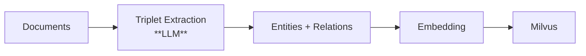
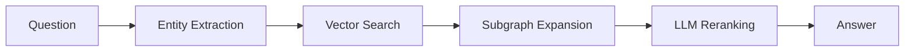
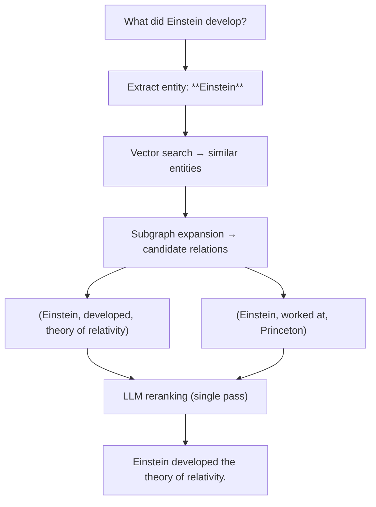

# How It Works

## Design Philosophy

Vector Graph RAG is built on three key principles:

### 1. No Graph Database

Traditional Graph RAG systems store knowledge in a graph database (Neo4j, ArangoDB, etc.) and use graph traversal queries (Cypher, Gremlin) to retrieve relevant subgraphs. This adds operational complexity: another database to deploy, a query language to learn, schema to maintain.

We store the entire knowledge graph — entities, relations, and passages — as vectors in Milvus. Retrieval becomes vector similarity search, which is simple, scalable, and requires no additional infrastructure.

### 2. Single-Pass LLM Reranking

Many RAG systems use iterative, agentic retrieval — the LLM decides what to retrieve next, reflects on results, and repeats. For example:

- **IRCoT** (Interleaving Retrieval with Chain-of-Thought) alternates between retrieval and reasoning over multiple rounds
- **Self-RAG** uses the LLM to critique and re-retrieve documents
- **Agentic RAG** gives the LLM tools to search iteratively

These approaches are powerful but expensive — each iteration costs an LLM call, adding latency and cost.

Vector Graph RAG uses a **single LLM reranking pass**. After vector search and subgraph expansion produce candidate relations, the LLM scores them once. This is sufficient because the vector search + subgraph expansion already provides high-quality candidates, and a single reranking step can effectively filter the best results.

### 3. Knowledge-Intensive Domains

Vector Graph RAG is especially effective for **knowledge-intensive content** — documents where dense factual relationships are the core value:

| Domain | Why Graph RAG Helps |
|--------|-------------------|
| **Legal** | Statutes reference other statutes, precedents cite precedents — graph captures these cross-references |
| **Finance** | Company relationships, ownership chains, transaction flows form natural graphs |
| **Medical** | Drug interactions, symptom-disease-treatment pathways are inherently relational |
| **Literature** | Character relationships, plot connections, thematic links across chapters |
| **Academic** | Citation networks, concept dependencies, methodology chains |

In these domains, naive RAG often fails because the answer requires connecting facts across multiple documents. The knowledge graph captures these connections explicitly.

---

## Architecture

### Indexing Pipeline

1. **Triplet Extraction** — An LLM extracts `(subject, predicate, object)` triplets from each document.
2. **Entity & Relation Storage** — Entities and relations are stored as vectors in Milvus collections.
3. **Embedding** — All text is embedded for vector similarity search.

### Query Pipeline

1. **Entity Extraction** — Extract key entities from the user's question.
2. **Vector Search** — Find similar entities and relations in Milvus.
3. **Subgraph Expansion** — Collect candidate relations by expanding around matched entities.
4. **LLM Reranking** — Use an LLM to score and filter the most relevant relations (single pass).
5. **Answer Generation** — Generate the final answer from the selected context.

## Worked Example

### Indexing

Given the passage: *"Einstein developed the theory of relativity at Princeton."*

- **Entities:** `Einstein`, `theory of relativity`, `Princeton`
- **Relations:**
    - `(Einstein, developed, theory of relativity)`
    - `(Einstein, worked at, Princeton)`

### Querying

For the question: *"What did Einstein develop?"*

1. Extract entity: `Einstein`
2. Vector search finds similar entities and relations
3. Subgraph expansion collects candidate relations
4. **LLM reranking** selects `(Einstein, developed, theory of relativity)` — one call, no iteration
5. Generate answer: *"Einstein developed the theory of relativity."*

## Comparison with Other Approaches

| Approach | Graph DB | LLM Calls per Query | Iterative | Complexity |
|----------|----------|---------------------|-----------|------------|
| **Naive RAG** | No | 1 (generation) | No | Low |
| **IRCoT** | No | Multiple (retrieve + reason loops) | Yes | High |
| **HippoRAG** | No | 1-2 | No | Medium |
| **Microsoft GraphRAG** | Yes (Neo4j) | Multiple | Yes | High |
| **Vector Graph RAG** | **No** | **2** (rerank + generation) | **No** | **Low** |
