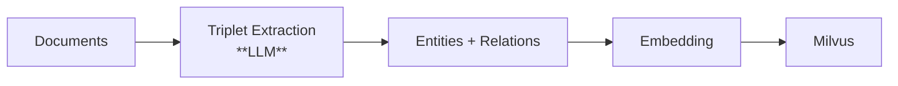
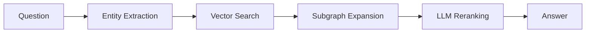
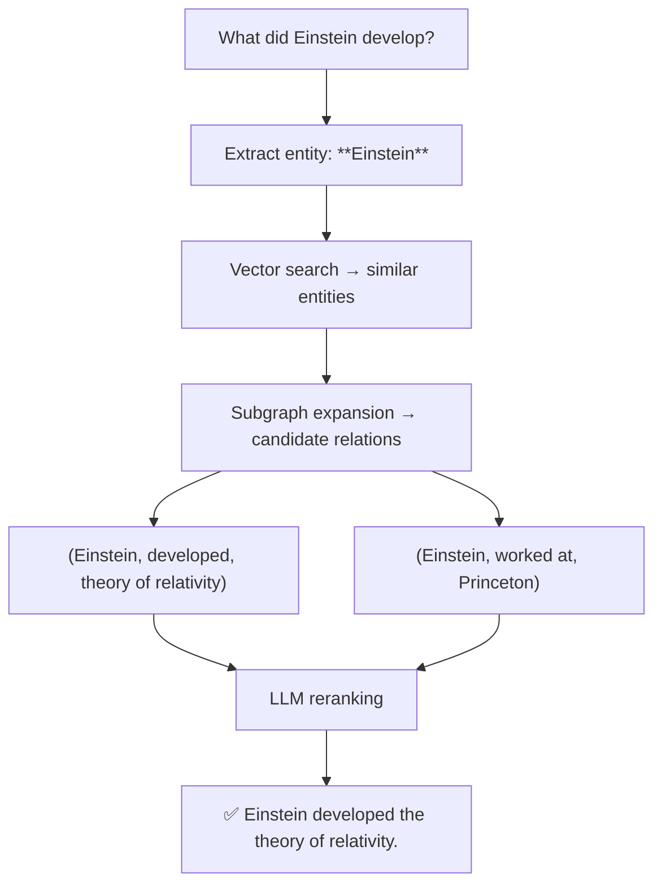

# How It Works

## Overview

Vector Graph RAG builds a knowledge graph stored entirely in a vector database (Milvus). It uses vector similarity search instead of graph traversal to find relevant entities and relations, eliminating the need for a separate graph database.

## Indexing Pipeline

1. **Triplet Extraction** — An LLM extracts `(subject, predicate, object)` triplets from each document.
2. **Entity & Relation Storage** — Entities and relations are stored as vectors in Milvus collections.
3. **Embedding** — All text is embedded for vector similarity search.

## Query Pipeline

1. **Entity Extraction** — Extract key entities from the user's question.
2. **Vector Search** — Find similar entities and relations in Milvus.
3. **Subgraph Expansion** — Collect candidate relations by expanding around matched entities.
4. **LLM Reranking** — Use an LLM to score and filter the most relevant relations.
5. **Answer Generation** — Generate the final answer from the selected context.

## Worked Example

### Indexing

Given the passage: *"Einstein developed the theory of relativity at Princeton."*

- **Entities:** `Einstein`, `theory of relativity`, `Princeton`
- **Relations:**
    - `(Einstein, developed, theory of relativity)`
    - `(Einstein, worked at, Princeton)`

### Querying

For the question: *"What did Einstein develop?"*

1. Extract entity: `Einstein`
2. Vector search finds similar entities and relations
3. Subgraph expansion collects candidate relations
4. **LLM reranking** selects `(Einstein, developed, theory of relativity)`
5. Generate answer: *"Einstein developed the theory of relativity."*
